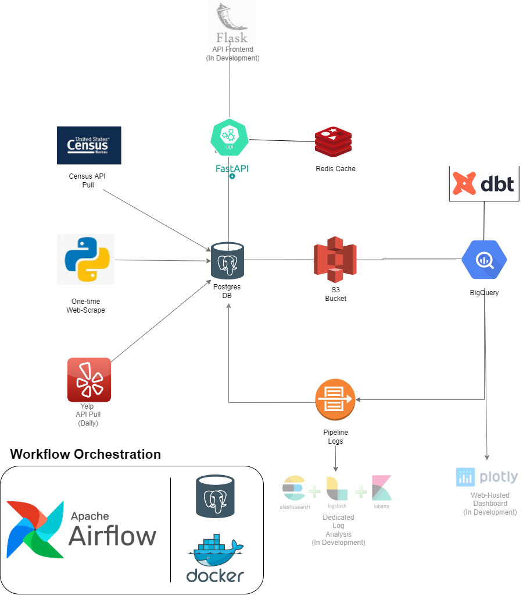

# Business Data Architecture

<a href="#overview">Overview</a> •
  <a href="#data-architecture-diagram">Data Architecture Diagram</a> •
    <a href="#concepts">Concepts</a> •
    <a href="#prerequisites">Prerequisites</a> •
    <a href="#set-up">Set-up</a> •
  <!-- <a href="#scenario">Scenario</a> •
  <a href="#base-concepts">Base Concepts</a> •
  
  
  <!-- <a href="#installation">Installation</a> •
  <a href="#airflow-interface">Airflow Interface</a> •
  <a href="#pipeline-task-by-task">Pipeline Task by Task</a> •
  <a href="#shut-down-and-restart-airflow">Shut Down and Restart Airflow</a> •
  <a href="#learning-resources">Learning Resources</a> --> -->

---

## Overview
This projects look to leverage multiple tools to create a data architecture that could help serve as the backend for a business. While the initial focus was simply ony creating an data pipeline to move the data from one source <em>x</em> to a data warehouse <em>y</em> the project has evolved to include a number of supplementary technologies/features partially due to problems that arose out of the blue. Fortunately while there may not always be meer solutions to everything there's always a nice trade-off i.e. compromise.\
To begin we'll extract data from 3 sources ,namely, the **Census API** , a [web page]("https://www.50states.com/abbreviations.htm") via webscrape, and the **Yelp API** and push this to a **Postgres** database.\
Initially this will be used to simulate a source db using **dbt** to normalize the data as would be expected in most OLTP dbs.\
With that setup data from yelp will be pulled daily and inserted into this source db.\
From there the data will be extracted to an **S3 Bucket** which will serve as our de-facto data lake.\
Subsequently the data will be pulled from the **S3 Bucket** and ingested into some staging tables in Google Big Query ,that will serve as our data warehouse, where we'll make use of **dbt** to denormalize the data into a Snowflake Model.\
Once this is done some simple data validation checks will be carried out and we'll log these results and route them back to our **Postgres** db to create some metrics with them and send notifications via flask in the event of any issues.\
To orchestrate our recurring data workflow we'll use **Apache Airflow** with a **Postgres** Instance that is ran in a **Docker** container.\
Also using the **FastAPI** framework we'll be able to create an API on top of our source database with **Redis** to cache certain responses.\
There are also other plans to extend this project which can be seen in the following data architecture diagram.

<!-- [link](#sample)
### sample -->

---

## Data Architecture Diagram

## Concepts
 - [Data Pipeline]()
 - [Database Migration]()
 - [hold]()
 - [hold]()
 - [hold]()
 - [hold]()
 - [hold]()
 - [hold]()
 - [hold]()
 - [hold]()
 - [hold]()

## Prerequisites
 - [Docker]()
 - [Docker Compose]()
 - [Census API Key]()
 - [Yelp API Key]()
 - [Postgres Database]()
 - [AWS S3 Bucket]()
 - [Google Big Query]()
 - [redis]()
 - [Python (needed libraries will be contained in requirements.txt)]()
 - [Python Virtuals Environment/s]()
 <!-- - [hold]()
 - [hold]() -->

## Set-up
At the moment this project spans several git repositories. Partially because a service-oriented architecture seemed more desirable and also as explained in the <a href="#overview">Overview</a> the project naturally evolved as I incorporated other concepts and technologies that I've learned.Nonetheless I certainly have plans to condense these repos into only in the future so both a grouped repo and the individual ones will remain available.\
For the time being here is the totality of the repositories that will be referenced\

- [Source DB Creation](https://github.com/raindata5/Gourmand-OLTP)
- [DWH Modeling](https://github.com/raindata5/gourmand-dwh)
- [API Creation](https://github.com/raindata5/gourmand-api)
- [Data Pipeline](https://github.com/raindata5/gourmand-data-pipelines)
- [Data Analysis](https://github.com/raindata5/data-analysis-business-economics-policy)
- [Data Orchestration with Apache Airflow](https://github.com/raindata5/pipeline-scripts)

1. Setting up the OLTP database \
Initially I was planning on creating this db using Microsoft SQL Server but fortunately I was able to use [Alembic]() to help with the db migration and it has the benefit of also helping set up this project.
    1. First clone the repo by doing `git clone https://github.com/raindata5/Gourmand-OLTP.git`
    2. Now go into the directory of this repo if you're not already there
    3. Here you're going to want to activate your virtual env and run `pip install -r requirements.txt`
    4. Now you can run `alembic upgrade head` and this will create the db staging tables
        > Note: Going forward when using alembic you can always delete my alembic config file and revision folder and run `alembic init` to have your own revison history
    5.

